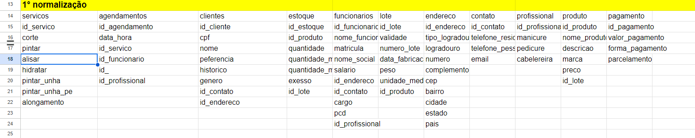
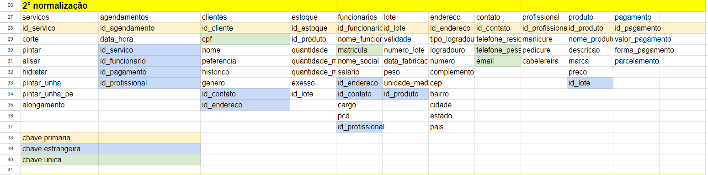

# estudo de caso cabelos incriveis
## cabelos incriveis

### O salão de cabeleireiro "Cabelos Incríveis" é um estabelecimento localizado em uma área movimentada da cidade. O salão oferece uma variedade de serviços, incluindo cortes de cabelo, coloração, tratamentos capilares, manicure e pedicure. Eles têm uma equipe de cabeleireiros talentosos e uma base de clientes fiéis.

### O salão de cabeleireiro "Cabelos Incríveis" está enfrentando dificuldades para gerenciar eficientemente seus clientes, agendamentos, estoque de produtos e informações dos funcionários. Eles precisam de um sistema de banco de dados para ajudar a organizar e automatizar esses processos.

## Modelo Lógico com as normalizações

### Primeira Normalização

### Segunda Normalização

### Terceira Normalização

